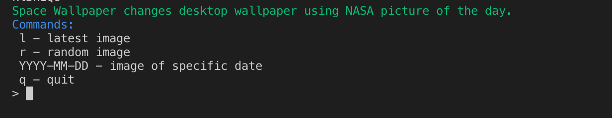
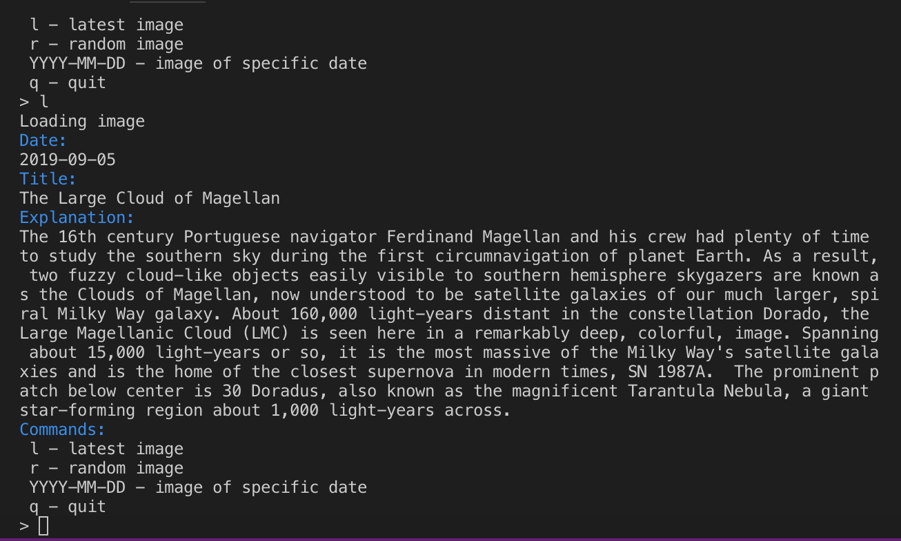
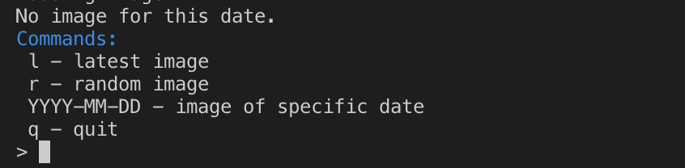
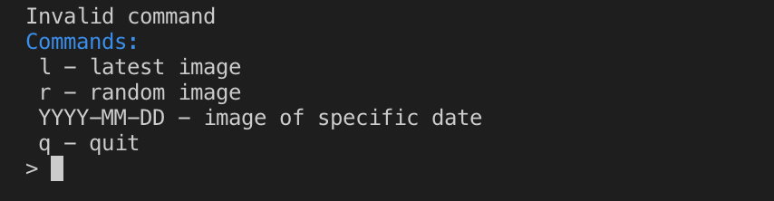
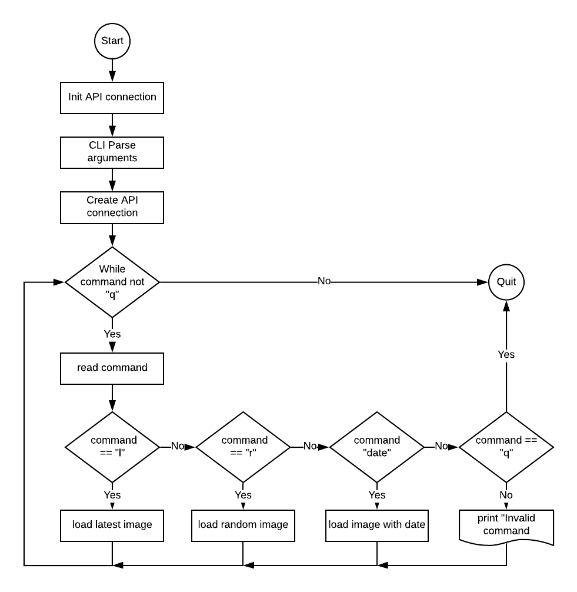
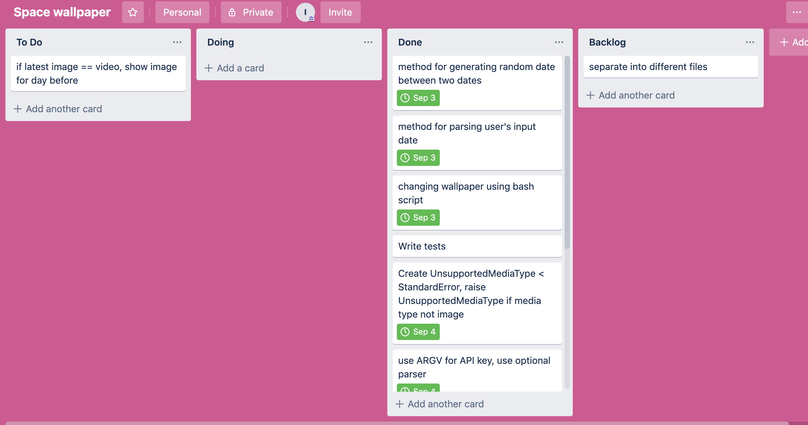

# Space Wallpaper 

## Statement of Purpose and Scope 

Space Wallpaper is a CLI application that brings breathtaking NASA space imagery to your desktop.

The application uses NASA Astronomy Picture of the Day API to download and change desktop wallpaper.

Desktop wallpaper is something you see every day but rarely have enough time to customize. The process of finding an image can be long and tedious. When the image is found it should be downloaded in a good quality. Then finally the System Preferences dialog window must be used to change the wallpaper. This application helps to skip all these steps by loading high definition images picked by the editors of NASA Astronomy Picture of the Day project.

The target audience is astronomy enthusiasts and the general public who uses macOS. The users start the application and are offered several options of loading images. They can load the latest image, a random image or an image for a specific date. When the user selects the option, corresponding image is set as a wallpaper and relevant information is printed on the screen. If the user is happy with the image, they can exit the application or they can choose another option.

## Features

### Latest image

Allows the user to change desktop wallpaper using latest picture from the NASA APOD website.

### Random image

Allows the user quickly change desktop wallpaper using random picture between 1995 and current date.

### Image of a specific date

Allows the user to choose image for a specific date. Format of the date: YYYY-MM-DD. The application should return error for invalid date. The application should not crash allowing the user to correct the date.

### Title of image and brief information 

Besides loading images the user can read the title of the image and brief explanation about the image which shows information about current events in astronomy and space exploration. 

### Reliability 

The application handles API errors, retrying temporary errors: HTTP status codes 429, 502, 503, 504 and networking problems. It also makes sure that the server running the API is not overloaded by too many retries.

### Extensibility

The codebase allows to extend functionality adding support for different APIs. The API clients should be easily swappable. 

## User Interaction and Experience

When the program first opens to the user, there will be information about application and list of commands which explains how to use it. 

Desktop wallpaper changes depending on chosen command: “l” - latest image, “r” - random image and image of a specific date. The user will see:
- current status information “Loading image” 
- information about image: date, title and explanation. 
- user’s desktop wallpaper automatically will be changed by the chosen image.

If the image is not found or there is a video instead of image, the user will receive an error message.

If the user types invalid command or command “YYYY-MM-DD” with incorrect date format they will receive an error message.

If the user choose option “q” - exit the application.

## Control Flow Diagram

Implementation Plan

Priority | Title | Description
--- | --- | ---
P0 | API client | Core functionality which establishes connection to NASA APOD API and performs API calls.
P0 | Image download | Gets the image and saves it to a file. 
P0 | Change desktop settings | Programmatically change desktop wallpaper. 
P1 | Random date selection | Choose a random date within given interval. The interval is between 1995 to current date. 
P2 | Custom date selection | Read custom date from user input, verify and attempt to download image. 
P1 | UI | Main user interaction loop. | 04/09/2019
P3 | Graceful handling of unsupported media formats. | Pick another date if there is no image for selected date. 

## User acceptance tests

### Multiple random images

This test covers the main use case: the user changes desktop wallpaper to a random image two or more times.

Test scenario:

1. Start application by running the following command in a terminal:
` ruby sw.rb -k DEMO_KEY `
1. Choose random image by typing “r”.
1. Wait for the image to download, corresponding message will be printed.
1. Verify that the desktop wallpaper has changed.
1. Choose another random image by typing “r”.
1. Wait for the image to download, corresponding message will be printed.
1. Verify that the desktop wallpaper has changed.
1. Type “q” to quit.

### Specific date image

This test verifies that correct image is downloaded for requested date.

Test scenario:

1. Start application by running the following command in a terminal:
` ruby sw.rb -k DEMO_KEY `
1. Type date 2019-09-03
1. Wait for the image to download, corresponding message will be printed.
1. Compare desktop image with the image on the website https://apod.nasa.gov/apod/ap190904.html
1. Type “q” to quit.

